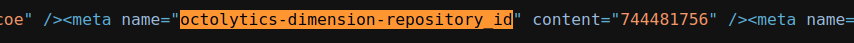
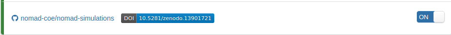
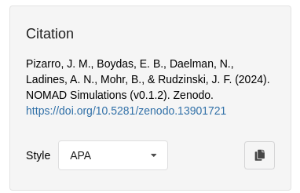
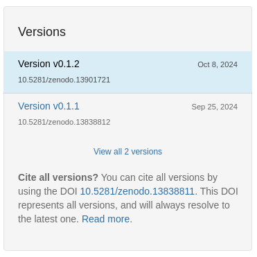

# Publishing NOMAD Software from GitHub to Zenodo
This repository serves as a resource for NOMAD developers and the FAIRmat community, providing comprehensive instructions and guidelines for publishing software from GitHub to Zenodo. The guidelines will ensure that software is properly cited and archived, making it accessible and reusable according to FAIR principles.


## Introduction
The FAIRmat project produces several open source software products related to NOMAD. To ensure that these results are properly archived, cited, and FAIR compliant, the FAIRmat developers publish their software in the [FAIRmat Zenodo Community](https://zenodo.org/communities/fairmat_nfdi).

Zenodo integrates with GitHub to automatically archive software (repositories), and this process ensures that each version of the software receives a Digital Object Identifier (DOI) for proper citation.

## Prerequisites
- A Zenodo account (linked to your GitHub account)
- Permission to manage the GitHub repository you plan to publish.


## Steps to Publish on Zenodo

### 1. **Link GitHub to Zenodo**

Go to Zenodo and sign in. Then navigate to your account settings and link your GitHub account.
Once this is done, Zenodo will list all the public repositories from the FAIRmat organization as long as your account has permission to manage them.
<div align="center">

</div>


### 2. **Enable Zenodo Integration**

In Zenodo, go to the "GitHub" section and find the repository you want to publish, then toggle the switch  to turn on automatic preservation of your software.
By toggling the switch to **ON**, Zenodo will preserve the software for the long term, regardless of changes or possible deletion on GitHub. This will also allow Zenodo to automatically archive the repository, meaning that every time a new release is created, it will be captured and stored. A DOI is also generated, making the software citable.

### 3. **Include a CITATION.cff file in your repository (Best Practice)**

To ensure that the published software contains all the metadata necessary for proper citation, a [CITATION.cff](https://citation-file-format.github.io/) file should be added to the root directory of the default branch in your repository. This file provides the necessary citation information, making it easier for others to properly cite your work.

#### What is CITATION.cff file?
It is a plain text file with human- and machine-readable citation information for software. It is supported by GitHub, Zenodo, and Zotero. For more information click [here](https://citation-file-format.github.io/)

#### How to create a citation.cff file to my repository?

- Please use the FAIRmat template available [here](template/).
- Copy the file and place it into the root directory of the default branch in your repository. Modify the placeholders (preceded by ##) with the relevant information specific to your project. Ensure all necessary fields are completed accurately for proper citation and metadata.

Some example files are also available [here](template/examples)


### 4. **Add Badge and Citation to README (Best Practice)**

#### Add Zenodo DOI badge to README

***Before making a release (Advanced)***

There is a way to automatically include the Zenodo DOI which will be created upon your first release (Step 5).

The Markdown expression to include at the top of the README file in your repository looks like:
`[](https://zenodo.org/badge/latestdoi/{github_id})`

To obtain the id for your repo, first go to the main repository page. Right click and select "View page source". This should open a new tab with html content. Search for `octolytics-dimension-repository_id` on this page. You should see something like:



Replace `{github_id}` in the expression above with the number in the `content` field of the `octolytics-dimension-repository_id`.

The DOI badge should now appear automatically once you complete Step 5.

***After making a release***

If you have already released the first version of your GitHub module (see Step 5 below) after enabling Zenodo integration (Step 2),
you can go back to the GitHub section in Zenodo and next to your repository name there will be a blue DOI badge:



If you click on this badge, you can copy the markdown expression to include at the top of your README. The syntax is:
`[](https://doi.org/{zenodo_repo_doi})
`

For example:

`[](https://zenodo.org/doi/10.5281/zenodo.13838811)`

#### Add Citation to README

It is good practice to also include the citation information within the README file under a "How to cite this work" heading.

***Before making a release***

Simply add the author information (same as the CFF file), e.g., in APA style:

```markdown
## How to cite this work
Pizarro, J.M., Boydas, E.B., Daelman, N., Ladines, A.N., Mohr, B. & Rudzinski, J.F., NOMAD Simulations [Computer software]. https://zenodo.org/doi/10.5281/zenodo.13838811
```

Note: you will need to add the exact DOI after step 5.

***After making a release***

You can directly copy the citation from the repo page on Zenodo (the citation is automatically generated from the CFF file):

<div align="center">

</div>

**Important** It is recommended to use the "all versions" DOI found on the repo page in Zenodo:

<div align="center">

</div>

### 5. **Release a Version in GitHub**

To trigger the publication process and the creation of a Zenodo DOI for your repo, [create a new release in GitHub](https://docs.github.com/en/repositories/releasing-projects-on-github/managing-releases-in-a-repository). Make sure to add version tags (e.g., v1.0.0) and update release notes. This publication process and DOI creation will proceed automatically after each new release.
<!-- After the first release, a DOI badge that can be included in GitHub README will appear next to the repository on the Zenodo dashboard.
<div align="center">

</div>

See Step 4 for more details. -->

### 6. Updating the Zenodo DOI

Now, the final step is to add the "all versions" Zenodo DOI to your repo metadata:

1. In the CFF file (see [template](template/).)

2. In the README citation (if already created one or copy over Zenodo citation to the end of the README file)


